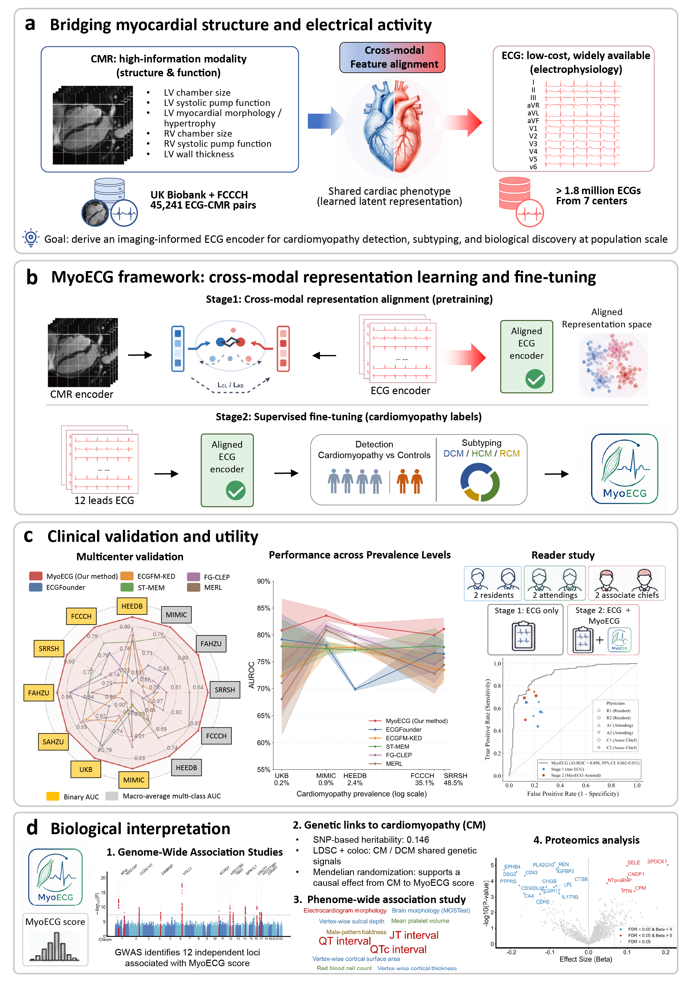

# MyoECG

This is the official implementation of our paper Cardiac MRI-informed electrocardiography enables biologically grounded cardiomyopathy detection.



## Abstract

Precise myocardial phenotyping at population scale remains challenging. Cardiac magnetic resonance (CMR) provides comprehensive assessment of cardiac structure, function and tissue characteristics, but its cost and limited accessibility restrict widespread use. Although electrocardiography (ECG) is inexpensive and widely available, it captures cardiac electrical activity rather than myocardial structure and function, limiting its diagnostic capability. Here we develop MyoECG, a cross-modal representation learning framework that distils myocardial structural and functional knowledge from CMR into standard 12-lead ECG representations, enabling imaging-informed cardiomyopathy detection and subtype classification using ECGs alone at inference. MyoECG was pretrained using 45,241 paired ECG–CMR examinations from both the UK Biobank and a tertiary cardiovascular centre, and subsequently developed and validated across more than 1.8 million ECGs from seven independent datasets. Across internal and six external validation datasets spanning disease prevalences from 0.2% to 54.7%, MyoECG consistently outperformed five representative pretrained ECG foundation models, achieving AUROCs ranging from 0.800 to 0.974 for cardiomyopathy detection. For subtype classification, MyoECG achieved a macro-AUROC of 0.941 (95% confidence interval (CI), 0.910–0.966) in the internal test cohort and maintained superior discrimination for dilated, hypertrophic and restrictive cardiomyopathy across four external datasets. In a multi-reader study involving six cardiologists with different levels of experience, MyoECG assistance improved mean sensitivity by 0.109 (95% CI, 0.041–0.175; P = 0.009) and specificity by 0.056 (95% CI, 0.004–0.108; P = 0.040). Applied to 41,128 UK Biobank participants, MyoECG generated a continuous imaging-informed ECG score, termed the MyoECG score, that exhibited significant genetic correlation with cardiomyopathy (rg = 0.362) and dilated cardiomyopathy (rg = 0.356), identified twelve associated genomic loci including TTN, KCNQ1 and CAMK2D, and was associated with circulating proteins involved in myocardial stress, endothelial activation and extracellular matrix remodeling pathways. By translating high-information cardiac imaging representations into routine ECGs, MyoECG establishes a scalable framework for imaging-quality cardiac phenotyping without imaging and illustrates a generalizable strategy for transferring knowledge from resource-intensive imaging modalities to widely deployable physiological signals.

## Environment Set Up

Install required packages:

```bash
pip install -r requirements.txt
```

Activate the newly created environment

## Example datasets and pretrained weights

Here is the example data, weights, and example run code for the two tasks of MyoECG: 


* **best-loss.pth** (ECG model Weights after ECG-CMR pretraining)
* **best-auc.pth** (ECG model Weights after Fine tuning of the cardiomyopathy label)
* **Simple_data_MIMIC.pkl** (MIMIC ECG data for testing)

To quickly use the MyoECG model, we have provided a simple startup script.

* Download best-auc.pth and place it in the **SimpleTest/MIMIC_test_output** directory.
* Download  Simple_data_MIMIC.pkl and place it in the **SimpleTest/MIMIC_test_data** directory.
  And run the following command to execute the script:

```
bash scripts/simple_test_mimic.sh
```

Upon running the script, the result files will be saved in the **SimpleTest/MIMIC_test_output** directory.

Please note that the MIMIC results reported here may differ slightly from those presented in the paper. This is because the current evaluation includes only patients with cardiomyopathy and a randomly selected, equally sized group of non-cardiomyopathy controls, whereas the results in the paper were obtained from the full MIMIC cohort of approximately 160,000 samples.

In addition, this simple test assumes that the ECG data have already been preprocessed. To evaluate the model on other datasets, please follow the ECG preprocessing procedures described in the paper and implemented in dataset.py.

## Citation

If you find our paper/code useful, please consider citing our work: 
1. Ding Z, Li Z, Hu Y, et al. Generating Cardiac Magnetic Resonance Images from Electrocardiograms—A Multicenter Study[J]. NEJM AI, 2026, 3(4)
2. MyoECG
